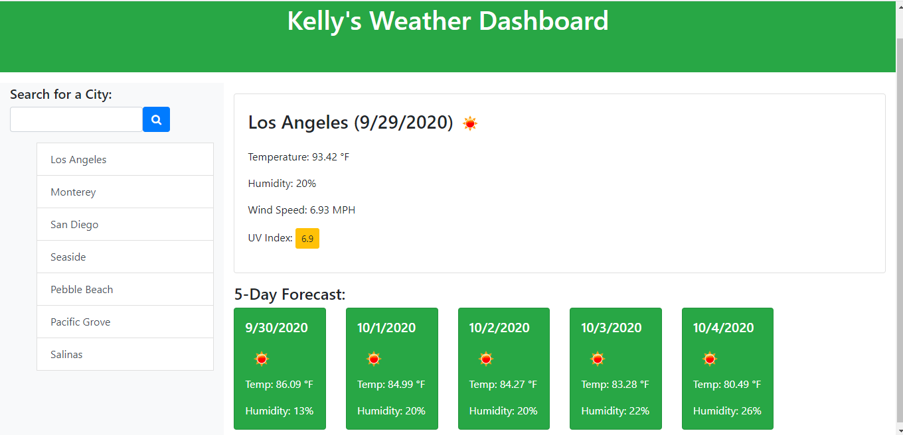
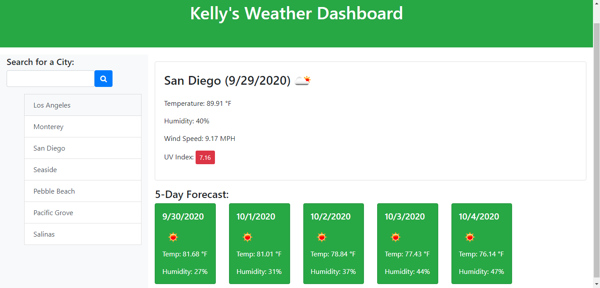
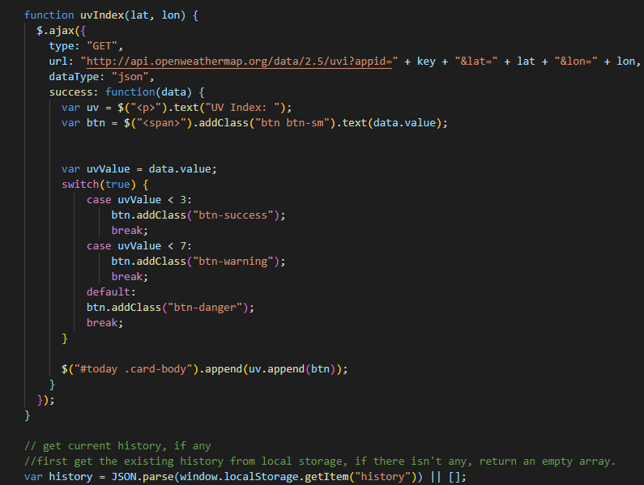

# Weather_Dashboard

The weather dashboard is an extremely convenient application! It allows a user to check on the weather outlook for multiple cities, so that they can plan a trip accordingly. All you would need to do is type in the city name and click search for a 5 day forecast with current and future conditions for that city to be presented. The list of information provided would include the city name, the date, an icon representation of weather conditions, the temperature, the humidity, the wind speed, and the UV index. The city is also added to the search history so you could simply just click back on the city name to view its weather again.

## Process

The weather dashoard homework requires that we retrieve data from another application's API such as the OpenWeather API. Accessing their data and functionality by making requests with specific parameters to a URL helped build this dashboard. It was very interesting to see OpenWeather's data take place into my weather dashboard and provide such detailed information.

 Below is a snippet of the UV index changing colors. The change of color indicates whether the conditions are favorable, moderate, or severe.

Here is a little clip of the code used to create the UV index.

### Installing/Technology Used

The following platforms were required to build this website:

1) VS code
2) GitBash/Terminal
3) GitLab
4) GitHub

## Built With

* [HTML](https://developer.mozilla.org/en-US/docs/Web/HTML)
* [CSS](https://developer.mozilla.org/en-US/docs/Web/CSS)
* [Javascript](https://developer.mozilla.org/en-US/doc/Web/CSS)

## Deployed Link

* [See Live Site](https://kellykim831.github.io/weather_dashboard/)

## Authors

* **Kelly Kim** 

- [Link to Github](https://github.com/kellykim831)
- [Link to LinkedIn](https://www.linkedin.com/in/realtorkellykim/)
- [Link to Facebook](https://www.facebook.com/kimkelz)

## Acknowledgments

* [Link to Google](https://www.google.com)
* [Link to W3 Schools](https://www.w3schools.com)
* [console.log()](https://developer.mozilla.org/en-US/docs/Web/API/Console/log)
* [Element.innerHTML](https://developer.mozilla.org/en-US/docs/Web/API/Element/innerHTML)
* [Document.querySelector()](https://developer.mozilla.org/en-US/docs/Web/API/Document/querySelector)